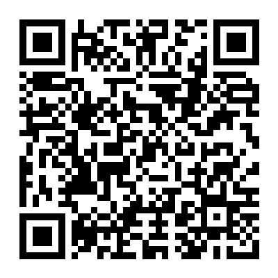

# Links

[Click here to get our website directly.](https://children-shopping-instruction-websi.vercel.app/)

# Demo Videos (Alphabetical Order)
You can click the following images to watch the demo videos on YouTube.
You can also find offline version via [demo-videos.zip](demo-videos.zip)
### Cash‑Payment Practice
#### 现金支付练习

### Electronic‑Payment Practice
#### 线上支付练习

### Electronic‑Payment Teaching
#### 电子支付教学

### Money Exchange Practice: Banknote Exchange
#### 兑钱练习：纸币兑换

### Money Exchange Practice: Mixed (Banknotes + Coins)
#### 兑钱练习：综合兑换（纸币＋硬币）

### RMB Banknote Teaching
#### 人民币（纸币）教学

### RMB Coins Teaching
#### 人民币（硬币）教学

### Shopping Simulation Practice
#### 购物模拟练习

### Voice Settings & Guide Character Settings
#### 智能语音设置＋导览角色设置
